# [Core Concepts (Section 2)](Kubernetes-CKA-0100-Core-Concepts.pdf)

## 11. k8s arch

- worker nodes are the ships that actually transport the cargo
- master node is the ship that loads the cargo ships / worker nodes
- master ship keeps track of what goes on what ship using control plane
  - control plane is comprised of
    - [etcd]: (k,v) store that knows what is on what ship
    - [kube-scheduler]: cranes on the master ship load worker ships based on
                        their size, capacity, what other containers are already
                        on the ship, etc.
    - [controller-manager]
      - [node-controller]
      - [replication-controller]
    - and this ^^ is all orchestrated by the [kube-apiserver]
- ALL nodes need container runtime (docker, containerd, rkt)
- ALL nodes need [kubelet]. kubelet is like the captain of the ship ... the 
  captain listens to instructions from kube-apiserver ... kube-apiserver polls
  kubelets to make sure status == spec
- [kube-proxy] on workers to make sure they can comm w/ each other ... think
  db talking to app on diff nodes

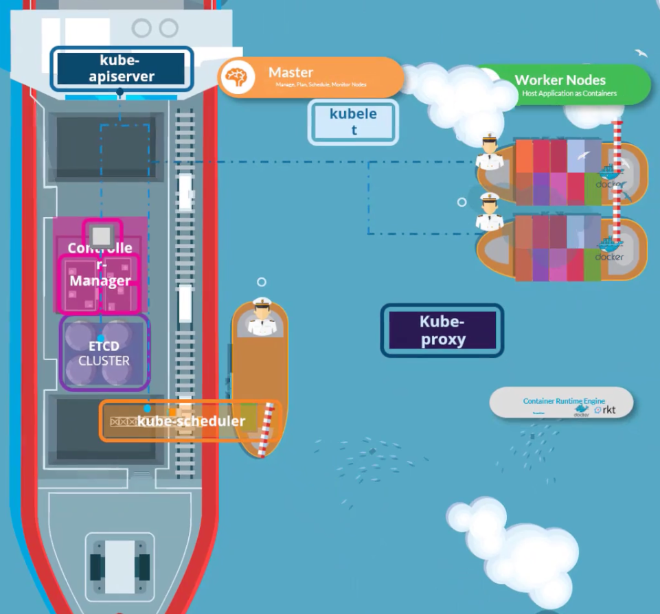
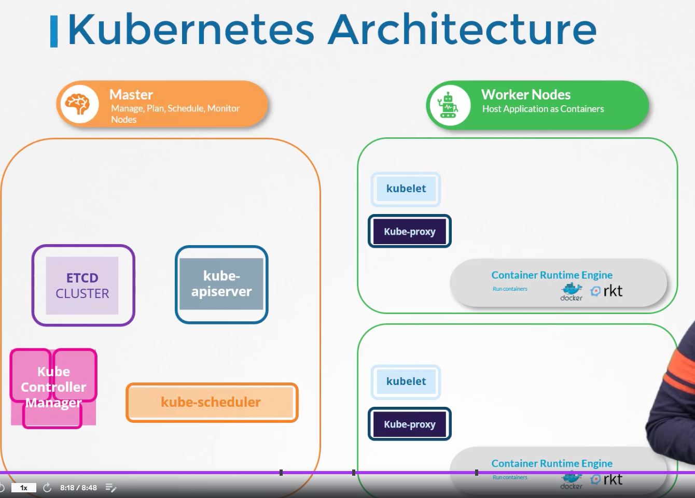

## 12. docker v containerd

- [CRI] so that ppl can use more than just Docker
- must adhere to [OCI]
  - [imagespec]: how to build an image
  - [runtimespec]: how ctr runtime should be built
- now rkt supported as container runtime via cri
- but docker did not support CRI, so k8s added "dockershim" to keep docker 
  working. 
- [runc] was docker ctr runtime ... [containerd] is the daemon that manages runc.
- containerd is CRI-compat, so it can work directly with k8s - and it can be 
  used as a runtime on its own, separate from docker.
- because containerd can run on it's own, and because it was a lot of effort
  to maintain dockershim, support for docker was removed from k8s in 1.24
- docker followed imagespec so anything that was already written is still
  supported thru containerd
- so containerd, which was a part of docker, is now it's own cncf proj. you 
  don't need docker anymore
- containerd comes with CLI [ctr] which is for debugging
  - $ ctr images pull docker.io/library/redis:alpine
  - $ ctr run         docker.io/library/redis:alpine redis
- but it's limited, use instead [nerdctl], which is a docker-like CLI for 
  containerd.
    - can more or less replace "docker" with "nerdctl" for all docker cmds
      - $ [docker | nerdctl] run --name redis     redis:alpine
      - $ [docker | nerdctl] run --name webserver -p 80:80 -d nginx
- [crictl] is designed to interact with things impl / compat w/ CRI
  - it works across different ctr runtimes, whereas nerdctl is developed by
    containerd, crictl is developed by k8s
  - it is mostly a debugging tool (like ctr), works along with kubelet
  - $ crictl pull busybox
  - $ crictl images
  - $ crictl ps -a
  - $ crictl exec -i -t <ctr-id> ls <-- run ls command inside ctr
  - $ crictl logs <ctr-id>
  - $ crictl pods <-- list pods ... docker can't do this

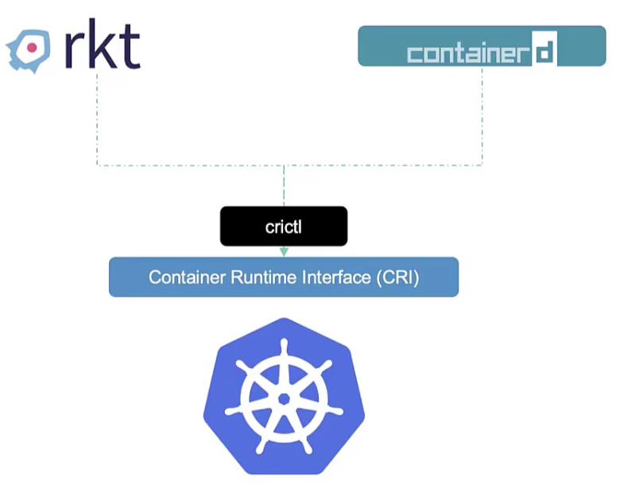
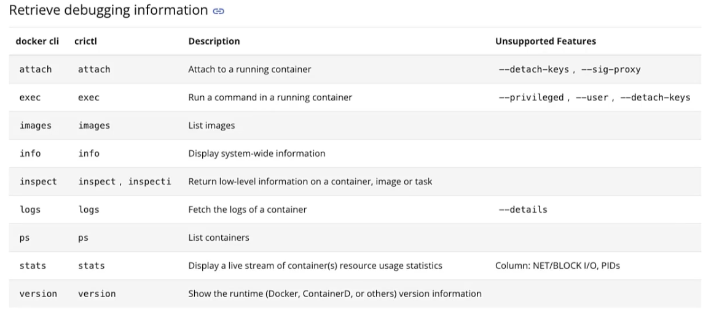
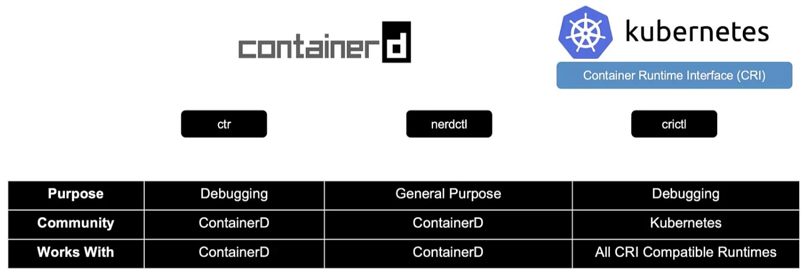

## 13. etcd for beginners

- in a typical rdbms, every time you add a column, you need to update everything
  - ex: [person, age, location] ... you end up with a lot of empty cells, or
        needing to backfill:

        person  | age   | location 
        john    | 45    | nyc
        dave    | 34    | nyc
        aryan   | 10    | nyc
        lauren  | 13    | bangalore
        lily    | 15    | bangalore

        let's add income info ... well, the young people won't have that, as
        they are students:

        person  | age   | location  | income 
        john    | 45    | nyc       | 5000
        dave    | 34    | nyc       | 4000
        aryan   | 10    | nyc       | --- 
        lauren  | 13    | bangalore | ---
        lily    | 15    | bangalore | ---

        let's add grades ... well, the old people won't have that, as they
        are workers:

        person  | age   | location  | income    | grades
        john    | 45    | nyc       | 5000      | ---
        dave    | 34    | nyc       | 4000      | ---
        aryan   | 10    | nyc       | ---       | A
        lauren  | 13    | bangalore | ---       | C
        lily    | 15    | bangalore | ---       | B

- [etcd] on the other hand, stores data in (k,v) pairs in "pages":

        {
            name: john,
            age: 45,
            location: nyc,
            income: 5000
        }
        {
            name: dave,
            age: 34,
            location: nyc,
            income: 4000
        }
        {
            name: aryan,
            age: 10,
            location: nyc,
            grades: A
        }
        {
            name: lauren,
            age: 13,
            location: bangalore,
            grades: C
        }
        {
            name: lily,
            age: 15,
            location: bangalore,
            grades: B
        }
- changes to one page don't affect others ... don't need to update all docs
  at once.
- [etcdctl] is CLI for etcd
  - $ etcdctl --version (etcdtl version != api version)
  - $ etcdctl   version (notice in v3, "version" is a subcommand, not an option
  - $ etcdctl set key1 val1 <-- etcd v2
  - $ etcdctl put key1 val1 <-- etcd v3
  - $ etcdctl get key1      <-- etcd v2
- etcd is cncf ... had big changes between v2 and v3 (2017) ... etcdctl will 
  work with both versions
    - to ensure working with v3:
      - $ export ETCDCTL_API=3
- when you don't set the api version, it is assumed to be v2 (why? - v3 came
  out 6 years ago!)

## 14. etcd in k8s

- stores info about: nodes, pods, configs, secrets, accounts, roles, bindings, 
  etc.
- every time you run `kubectl get` you are getting that info from etcd server
- changes are not considered complete until they happen in the etcd server
- etcd start option `--advertise-client-urls` is where etcd is listening
- by default, port 2379
- if you set up k8s cluster using [kubeadm], kubeadm will set etcd up as a Pod
  in the kube-system ns ... in this case, want to get all keys?
    - $ kubectl exec etcd-master -n kube-system etcdctl get / --prefix -keys-only

## 15. etcd - commands
 
| v2 | v3 |
| - | - |
| etcdctl backup | etcdctl snapshot save |
| etcdctl cluster-health | etcdctl endpoint health |
| etcdctl mk | etcdctl get |
| etcdctl set | etcdctl put |

`kubectl exec etcd-master -n kube-system -- sh -c "ETCDCTL_API=3 etcdctl get / --prefix --keys-only --limit=10 --cacert /etc/kubernetes/pki/etcd/ca.crt --cert /etc/kubernetes/pki/etcd/server.crt --key /etc/kubernetes/pki/etcd/server.key"`

## 16. kube-apiserver

- kubectl: (can do everything by api direct (curl, etc.) , without using kubectl)
  - calls kube-apiserver
    - kube-apiserver:
      - intercepts request, 
      - validates it (auth / auth / admit)
      - gets data from etcd 
      - responds back
- scheduler monitors kube-apiserver, 
    - tells kube-apiserver where to put pods, 
    - then kube-apiserver updates etcd, 
    - then kube-apiserver passes the new info to kubelet on a node,
    - then kubelet creates a pod on the node and tells the ctr runtime engine to deploy the app image,
    - when done, kubelet lets kube-apiserver know, 
    - and kube-apiserver lets etcd know
- the basic path is always:
  - 1. authenticate user (kube-apiserver)
  - 2. validate request  (kube-apiserver)
  - 3. retrieve the data (kube-apiserver)
  - 4. updtate etcd      (kube-apiserver)
  - 5. scheduler         
  - 6. kubelet            
  - 7. then back up the chain to etcd
- just like with etcd, you can install kube-apiserver as a standalone service
  on the control plane node. see options at:
  `/etc/systemd/system/kube-apiserver.service`
- just like with etcd, if you used kubeadm to set up the cluster, kube-apiserver
  is deployed as a pod in kube-system ns. see options at:
  `/etc/kubernetes/manifests/kube-apiserver.yaml`
- you can also just look at the process on the master node:
  `ps aux | grep kube-apiserver`

## 17. kube controller manager

- node-controller default check ("node monitor period") is 5s ... 
  "grace period" (time until it marks node as "unreachable") is 40s ... 
  after node is marked "unreachable", we give it 5m to come back up ("pod eviction timeout")
- if we reach pod eveiction timeout, node controller moves those pods from that
  node to other nodes, as long as they were part of ReplicaSet
- there are controllers for everything ... think about it ... what is a "Kind"
  and how do we ensure each "Kind" is behaving as in spec? by watching it. Each
  CRD can have a controller associated with it.
- all controllers in your cluster are pkgd into a single proc called 
  "kube-controller-manager" ... ^^ those things like node monitor period, 
  grace period, etc., go into the kube-controller-manager service as options:
  - `--node-monitor-period=5s`
  - `--node-monitor-grace-period=40s`
  - `--pod-eviction-timeout=5m0s`
- and we enable which controllers to use here too:
  - `--controllers stringSlice  Default[*]` <-- all controllers enabled default
    - ^^ if some controller(s) don't seem to work/exist, this is a good first
      troubleshooting step ... check this list.
- same as kube-apiserver, same as etcd, if you installed cluster via kubadm,
  kube-controller-manager lives as a pod on the master node. cfg is here:
  `/etc/kubernetes/manifests/kube-controller-manager.yaml`
- if you hand rolled your cluster ("the hard way"):
  `/etc/systemd/system/kube-controller-manager.service`
- `ps aux | grep kube-controller-manager`

## 18. kube scheduler

- remember: kube-scheduler only _decides_ what node a pod should go on, it does
  _not_ actually place it there. that's up to the kubelet on the proper node
  ("kubelet on a node" == "captain on a ship")
- imagine diff sized ships going to diff places ... this is like diff nodes
  with diff resources, serving diff apps. the scheduler has to know all these
  constraints to make sure to tell the captain of the right ship that this 
  pod (with containers) is to go on his ship. you don't want to put the wrong 
  pods (with containers) on the wrong ships.
- scheduler does this in 2 phases:
  1. filter - ex: only consider nodes that meet memory and cpu requirements
  2. rank   - uses a prio function to give each remaining node a score 0-10
            - one way is to calculate how much space would be left on the node
              after we put this pod on it 
- we can customize everything and even add our own scheduler
- scheduler also looks at: taints, tolerations, node selectors, affinity 
- same as kube-controller-manager, same as kube-apiserver, same as etcd, 
  if you installed cluster via kubadm, kube-scheduler lives as a pod on the 
  master node. cfg is here:
  `/etc/kubernetes/manifests/kube-scheduler.yaml`
- if you hand rolled your cluster ("the hard way"):
  `/etc/systemd/system/kube-scheduler.service`
- `ps aux | grep kube-scheduler`

## 19. kubelet

- captain of individual worker ships
- single point of contact from worker ships to master ship (ctrl pln)
- "responsible for all paperwork"
- load or unload containers (pods) from their ships as instructed by scheduler
- send back regular reports on status of ship
- kube-scheduler tells kube-apiserver pod goes to node a 
  - kube-apiserver tells kubelet on node a to create the pod
    - kubelet on node a tells container runtime on node a to pull image and create instance
      - kubelet monitors and reports back to kube-apiserver
- important note: kubeadm does _not_ auto deploy kubelet ... diff to the other 
  components so far. must _always_ manually install kubelets on workers.
  = download the installer, extract it, use it as a service
- `ps -aux | grep kubelet`

## 20. kube-proxy

- is a process that runs on each node in the cluster
- job is to watch for new services and then create rules for that service
  on each node
- iptables rules
- same as kube-scheduler, same as kube-controller-manager, same as kube-apiserver, 
  same as etcd, if you installed cluster via kubadm, kube-scheduler lives as a pod 
  on the master node (but all other nodes as well). it is actually deployed
  as a daemonset --> a single pod is _always_ deployed to each node in the cluster.
  - `k get pods -n kube-system` 
  - `k get daemonset -n kube-system`

## 21. recap - pods

- pod is single instance of an app
- pod is the smallest obj you can create in k8s
- multi-ctr pods are rarely used
- even if you have one ctr, k8s makes you put it in a pod

## 22. pods with yaml

```
apiVersion:
kind:
metadata:
spec:
```

## 23. demo - pods with yaml

## 24. practice test introduction

## 25. demo: accessing labs

support@kodekloud.com

## 26. course setup - accessing the labs

- [kodekloud lab env](https://uklabs.kodekloud.com/courses/labs-certified-kubernetes-administrator-with-practice-tests/)
- [kodekloud dashboard](https://learn.kodekloud.com/user/dashboard)

## 27. practice test - pods

## 28. practice test - solution

- instead of doing a describe on every pod to get all images, just do `-o wide`
  `kubectl get pods -o wide`
- in addition to doing redis.yaml directly ("declaratively"), we can also do it
  "imperatively" with dry-run:
  `kubectl run redis --image=redis123 --dry-run=client -o yaml > redis.yaml`
- instead of editing the yaml to change image name, remember `kubectl edit`

## 29. recap - replicasets

- replicationcontroller - old way (see other notes)
- helps us run multiple instances of our app (pod) in cluster
- should use RC even with one pod in case it fails
- helps us with scaling and LB
- spans N nodes
- replicaset is replacing replicationcontroller
- see [replicationcontroller yaml](replicationcontroller.yaml) and [pod yaml](pod.yaml)
  - note: `replicationcontroller.yaml[.spec.template] === pod.yaml[.metadata+]`
- if you get an error like 
```
error: unable to recognize "replicaset-definition.yaml": no matches for /, Kind=ReplicaSet"
```
it's because the apiVersion is wrong. if you don't know what api version it 
should be ... do `k explain replicaset` 
- replicaset definition is same as replicationcontroller definition, except that
  replicaset requires a "selector" definition ... compare 
  [replicationcontroller yaml](replicationcontroller.yaml) and [replicaset yaml](replicaset.yaml)
  - why do we need such a selector? RS can manage Pods that were created outside
    of the RS.
  - actually, for RC, you can also have a "selector", but it is not required as
    it is for RS. when omitted, it uses the same labels as in pod defn.
- RS wants to make sure we run N copies at any given time
  - RS is a process that monitors pods, that's why it needs labels - to filter
    out which pods to watch
- scale RS:
  - way 1: update "replicas: N" in rs.yaml, then `k replace -f rs.yaml`
  - way 2: `k scale --replicas=N -f rs.yaml`
  - way 3: `k scale --replicas=N replicaset myapp-replicaset`
  - way 4: `k edit ...` ?

## 30. practice test - replicasets

## 31. practice test - replicasets solution

- after you edit a RS, the pods do not auto-delete ... you need to delete the pods
  yourself, then the RS will regen them with the new defn.

## 32. deployments

- different to RS in that RS updates everything at once, which could cause 
  disruption to end users ... Deployment does _rolling update_. can also do
  rollback.
- also different in that you can make multiple changes, pause, resume, roll out 
  everything at once.
- [Deployment[ReplicaSet[Pod[Ctr]]]]
- yaml defn _exactly the same_ as RS, just kind = Deployment instead
- deployment creates RS

## 33. certification tip

- use `kubectl run` as much as possible, instead of hand-writing yaml defns:
  - `kubectl run nginx --image=nginx`
  - `kubectl run nginx --image=nginx --dry-run=client -o yaml`
  - `kubectl create deployment --image=nginx nginx`
  - `kubectl create deployment --image=nginx nginx --dry-run=client -o yaml`
  - `kubectl create deployment --image=nginx nginx --dry-run=client -o yaml > deployment.yaml`
  - `kubectl create deployment --image=nginx nginx --replicas=4 --dry-run=client -o yaml > deployment.yaml`
- bookmark [kubectl usage conventions](https://kubernetes.io/docs/reference/kubectl/conventions/)

## 34. practice test - deployments

## 35. solution - deployments

## 36. services

- like a virtual server inside the node
- `NodePort`: a k8s obj that listens to a port on a node, fwd-ing traffic from that port to 
  a port on our pod (our app) ... port must be 30000..32767
  - if you don't provide a targetPort in the defn, it is assumed == port in the defn
  - if you don't provide a nodePort, it will randomly assign one
  - we use labels and selectors to group the Pods the Service will use ... labels 
    in Service defn [.spec.selector] must === labels in Pod defn [.metadata.labels]
  - Service uses a "Random" algo w/ session affinity, and so acts as a built-in LB
- `ClusterIP`: (= default svc type) service creates a virtual ip inside cluster
- `LoadBalancer`

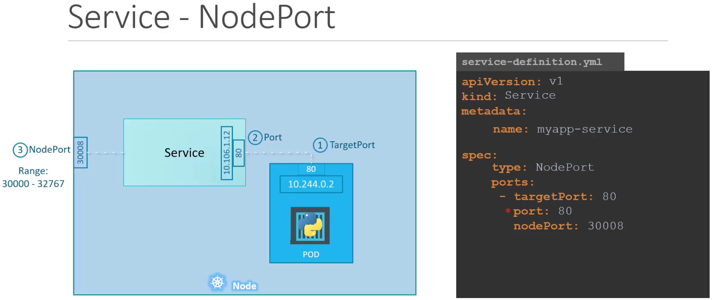
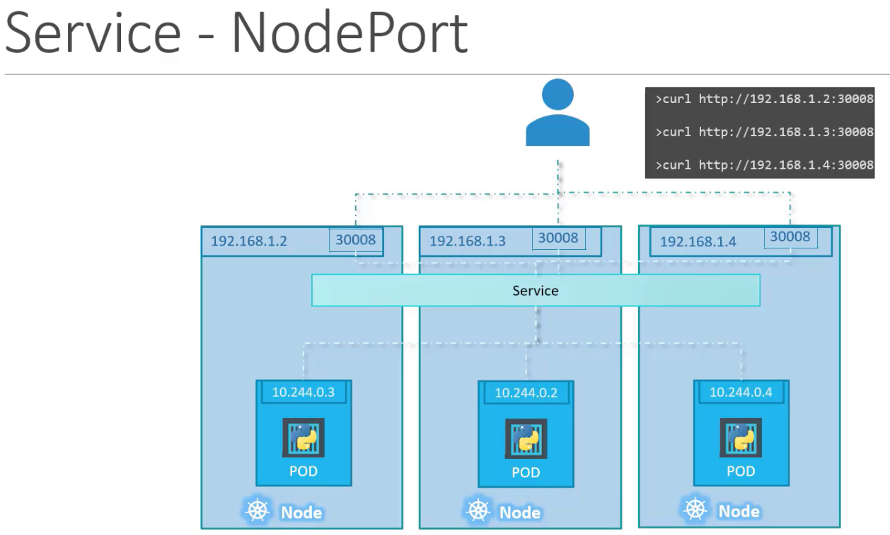

## 37. services cluster ip

- app usually has diff types of pods hosting diff parts of the app:
  - N pods for: frontend (ex: python web server)
  - N pods for: backend services
  - N pods for: (k,v) store (ex: redis)
  - N pods for: persistent db (ex: mysql)
- these diff pods all need to talk to eachother - frontend pods need to talk to
  backend pods, backened pods need to talk to persistent db pods, etc.
- but pods can go down and be replaced any time ... 
- what's the best way to do traffic between these diff app tiers?
- the IP addys are not static --> can't rely on IP addy to comms
- and - when frontend pod wants to talk to backend, which pod does it talk to - 
  how do we make that decision?
- service groups them together and provides a single iface for access
- in this case, we have 3 services: "backend" for accessing backend pods,
  "redis" service for accessing redis pods, "db" service for accessing mysql
- each tier is disconnected (decoupled) and can scale as needed  

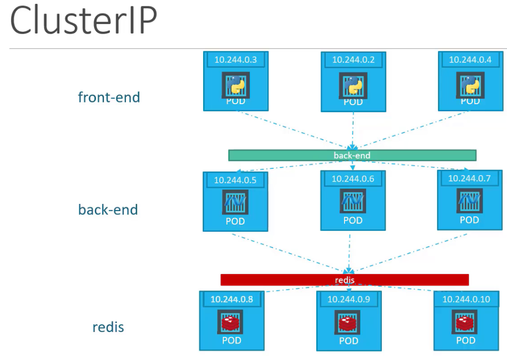

## 38. services - loadbalancer

- could add a vm and cfg haproxy or nginx lb - but this is a lot of maint overhead
- instead, integrate with native LB at CSP 
- only works with supported CSP (GCP, AWS, Azure) ... only diff in defn file is
  [.spec.type] = LoadBalancer
- if you set [.spec.type] to LB and it's an unsupported CSP, then it has the 
  effect of creating a NodePort Service type.

## 39. practice test - services

- endpoints = how many pods is this svc directing traffic to
- [k8s service docu](https://kubernetes.io/docs/concepts/services-networking/service/#defining-a-service)

## 40. solution - services

## 41. namespaces

- connecting to a service in namespace, call it by it's name:
  `mysql.connect("db-service")`
- connecting to a service in another namespace, call it by:
  `mysql.connect("db-service.dev.svc.cluster.local")`
   - {name}.{namespace}.{service}.{domain}
- [.metadata.namespace]
- `$k config set-context $(kubectl config current-context) --namespace=dev`
- we use diff contexts to manage multiple clusters in multiple envs from the same place

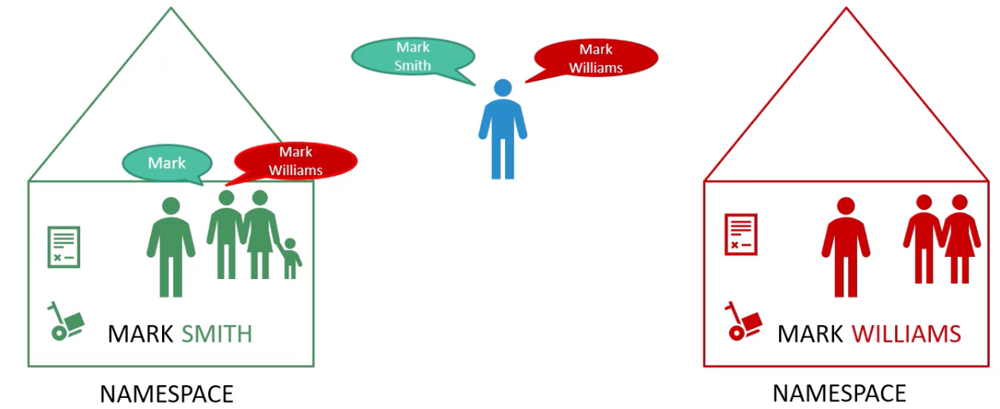
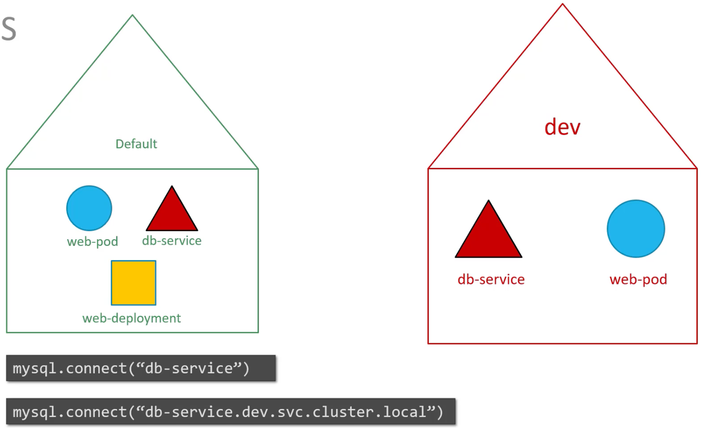
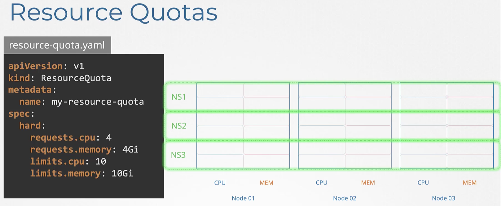

## 42. practice test - namespaces

## 43. solution - namespaces

## 44. [imperative vs declarative](https://kubernetes.io/docs/tasks/manage-kubernetes-objects/)

- imperative:  do Y to give me X
  - `kubectl [run, create, expose, delete, scale, set, create, replace]`
  - `k edit` doesn't edit the orig yaml ... if you later edit + reapply that yaml, your change (edit) is gone
    - to get around this problem, instead edit the manifest directly, and replace with `k replace -f something.yaml`
    - think about also: you lose some of change history when you `k edit`
    - can also `k replace --force -f something.yaml`
  - drawbacks:
    - run once in user session ... hard for someone else to figure out how the obj was created
    - can make a mistake when typing it Nx
    - can be long to write (ex: creating a multi-container pod)
- declarative: give me X
  - `kubectl apply -f something.yaml` <-- will create if not exists, whereas replace will error out if not exists
    - ^ `k apply` vs `k create` and `k replace`
- [kubectl reference](https://kubernetes.io/docs/reference/generated/kubectl/kubectl-commands)

## 45. certification tips - imperative commands with kubectl

- `kubectl expose pod redis --port=6379 --name redis-service --dry-run=client -o yaml`
  - create a svc of type clusterip exposing redis on port 6379
  - pod's labels used as selectors
- `kubectl create service clusterip redis --tcp=6379:6379 --dry-run=client -o yaml`
  - same, but assume selectors are "app=redis" 
- `kubectl expose pod nginx --type=NodePort --port=80 --name=nginx-service --dry-run=client -o yaml`
  - create a svc of type nodeport exposing nginx on port 80
- `kubectl create service nodeport nginx --tcp=80:80 --node-port=30080 --dry-run=client -o yaml`
  - same

## 46. practice test - imperative commands

## 47. solution - imperative commands

- 
```
controlplane ~ ➜  kubectl run nginx-pod --image=nginx:alpine
pod/nginx-pod created

controlplane ~ ➜  kubectl run redis --image=redis:alpine --labels=tier=db
pod/redis created

controlplane ~ ✖ kubectl expose pod redis --port 6379 --name redis-service
service/redis-service created

controlplane ~ ➜  kubectl create deployment webapp --image=kodekloud/webapp-color --replicas=3
deployment.apps/webapp created

controlplane ~ ➜  kubectl run custom-nginx --image=nginx --port=8080
pod/custom-nginx created

controlplane ~ ➜  kubectl create ns dev-ns
namespace/dev-ns created

controlplane ~ ➜  kubectl create deployment redis-deploy --image=redis --replicas=2 -n dev-ns
deployment.apps/redis-deploy created

# could do the next one by first kubectl run pod then expose service, as above
# but one step method is:
controlplane ~ ➜  kubectl run httpd --image=httpd:alpine --port=80 --expose=true
service/httpd created
pod/httpd created
# you can look in kubectl run --help to see the --expose option 
```

## 48. kubectl apply command

- kubectl apply checks if something exists, creates it if not ... but what it creates
  is the "last applied configuration", which is a json file (stored on the live object configuration as [.metadata.annotations...last-applied-configuration]) <-- this _only_ happens with k apply, not with k run or k create ...
- now, whenever we do something to this file in the future, it compares:
  - local "something.yaml"
  - "last applied configuration"
  - "live object configuration" (with the status, etc.)

  to determine what to do. see [merging changes to primitive fields](https://kubernetes.io/docs/tasks/manage-kubernetes-objects/declarative-config/#merging-changes-to-primitive-fields) for more info 

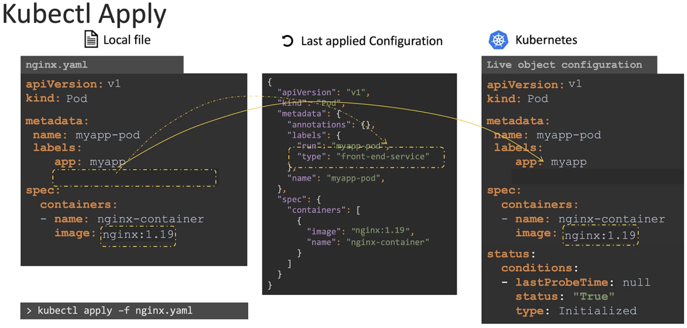

## 49. here's some inspiration to keep going

## 50. a quick reminder

