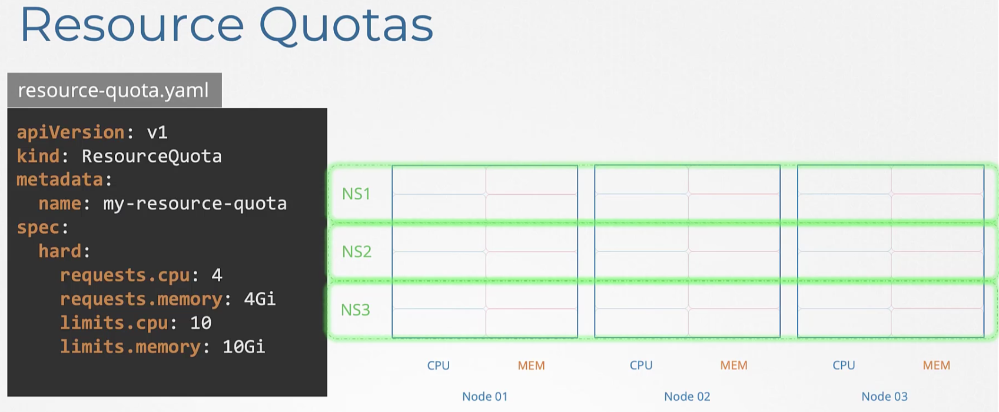

# Scheduling (Section 3)

## 51. scheduling section introduction

## 52. download presentation deck for this section

- [Kubernetes-CKA-0200-Scheduling.pdf](Kubernetes-CKA-0200-Scheduling.pdf)
- [Networking.pdf](Networking.pdf)
- [Udemy-Kubernetes-taints-tolerations.pdf](Udemy-Kubernetes-taints-tolerations.pdf)
- [Static-Pods.pdf](Static-Pods.pdf)

## 53. manual scheduling

- each pod defn has a `nodeName` property ... scheduler starts by running over the 
  pods, looking for the ones that don't have this property set = candidates for scheduling.
- it then runs thru algo and creates a binding obj by setting the node name to the one w/highest score
- you can ofc set this manually in the manifest - but only at pod create 
  - k8s won't allow manual change if pod already exists, so, if a pod already exists and you want to 
    manually assign to a node, then you need to create a binding object:
```
apiVersion: v1
kind: Binding
metadata:
  name: nginx
target:
  apiVersion: v1
  kind: Node
  name: <node-name>
```

^^ you need to send this equivalent to the pod api in json format:

`curl --header "Content-Type:application/json" --request POST --data '{"apiVersion":"v1",:kind":...}' http://<server>/api/v1/namespaces/default/pods/<podname>/binding`

- `k get nodes`

## 54. practice test - manual scheduling

- check if there is a scheduler present:
  - `kubectl get pods -n kube-system -l component=kube-scheduler`
  - scheduler runs as a pod in the kube-system ns
- also could describe the pod and see "Node:" is "<none>"
```
controlplane ~ ➜  kubectl get pod nginx -w
NAME    READY   STATUS              RESTARTS   AGE
nginx   0/1     ContainerCreating   0          6s
nginx   1/1     Running             0          8s
```

## 55. solution - manual scheduling

- `k replace --force ...` is the same as `k delete ...` + `k apply`

## 56.  labels and selectors

- used to group and select objs
- @pod spec: [.metadata.labels] then `k get pods --selector key=val`
- @RS  spec: [.metadata.labels] === [.spec.template.metadata.labels] because 
  the [.spec.template] is ofc a pod spec for pods in that RS (?)
```
The ReplicaSet "replicaset-1" is invalid: spec.template.metadata.labels: Invalid value: map[string]string{"tier":"nginx"}: `selector` does not match template `labels`
```
  - [.metadata.labels] are there for _other_ objs to discover the RS
  - [.spec.selector.matchLabels] is for the RS to know what pods it controls
    by matching these labels on pods. so:
    RS[.spec.selector.matchLabels] === Pod[.metadata.labels]
- same for Service
- annotations are for other generic metadata [.metadata.annotations]

## 57. practice test - labels and selectors

- `kubectl get pods --selector=env=dev --no-headers | wc -l`
- `kubectl get pods --selector=env=prod,bu=finance,tier=frontend`

## 58. solution: labels and selectors

## 59. taints and tolerations

- restrict what pods go on what nodes
- imagine a person puts on bug spray - this person is a _node_ and the spray is a _taint_ 
  - the bug (a _pod_) is intolerant to the smell, so does not land on the person (_node_)
  - but - there could be other bugs that aren't affected by this particular spray,
    so they land on the person anyway. these bugs (_pod_s) _tolerate_ (are unaffected by) the _taint_ (bug spray)
  - so two things detm if a pod can be placed on a node: 
    - the node's taint
    - the pod's toleration to that particular node's taint
- example
  - by default, we'll try to equally spread pods across nodes
  - now assume dedicated resources on node 1
    - this could be for a particular use case, app, etc.
    - so we want only pods that belong to that particular use case (app) to be placed on node 1
      - first, place a taint on node 1 to prevent _all pods_ from being scheduled on that node
      - by default, pods don't have tolerations, so by default, no pods can tolerate that taint
      - so now we place a toleration on particular pods ... now scheduler will place only those
        particular pods with tolerations that match the taint on the node on the node
- `kubectl taint nodes <node-name> key=val:<taint-effect>`
  - <taint-effect> is what happens with pods that don't tolerate the taint. 3 effects:
    - `NoSchedule`
    - `PreferNoSchedule` - best effort don't place this pod on this node
    - `NoExecute` - default - don't put new pods without tolerations on this node, and existing pods without toleration evicted. this could happen, for example, if a taint was applied to a node after it was already humming along with pods on it.
    - example:
      - `kubectl taint nodes node1 app=blue:NoSchedule`
- to add the matching toleration to a pod:
```
...
spec:
  ...
  tolerations:
  - key: "app"
    value: "blue"
    operator: "Equal"
    effect: "NoSchedule"
...
```
- taints and tolerations however, do _not_ tell a pod to go to a particular node.
  a pod with a toleration for node1 may end up going to node2. all the taint and
  toleration does is say the pod _may_ go to node1. it's not guaranteed.
- to do that ^^^^, you need _node affinity_.
- control plane node doesn't get pods scheduled because k8s auto taints it on
  creation to prevent putting pods there. you could change this, but it is not good practice.
  - `k describe node kubemaster | grep Taint`
    - gives: "Taints: node-role.kubernetes.io/master:NoSchedule"

## 60. practice test - taints and tolerations

## 61. solution - taints and tolerations

- remove a taint either by `k edit ...` or ... use the normal taint command but add '-' to the end:
  `k taint node <node-name> node-role.kubernetes.io/master-NoSchedule-`

## 62. node selectors

- imagine you have 3 nodes, 2 are "normal", one is "big" ... you have diff kinds of workloads
  running in cluster. you want workloads requiring more resources to run on the "big" node.
- two ways:
  - @ pod defn: [.spec.nodeSelector] === [.metadata.labels] @ node defn
    - one way to label node: `k label nodes <node-name> key=val`
  - node affinity

## 63. node affinity

- if you need more complex node selection for a pod, you can't use labels ... 
  ex: "<large> OR <medium>", "NOT <label>"
- whole goal of affinity is to ensure particular pods go to particular nodes
- ex: ensure pod goes to nodes labeled "size=Large":
  - with nodeSelector:
    - [.spec.nodeSelector] = "size: Large"
  - with affinity:
    - 
```
...
spec:
  ...
  affinity:
    nodeAffinity:
      requiredDuringSchedulingIgnoredDuringExecution: # = what is scheduling behavior when no node has this label 
        nodeSelectorTerms:
        - matchExpressions:
          - key: size
            operator: In # can also use "NotIn", "Exists" (just checks if this label is on the node, don't care the value), etc. 
            values:
            - Large      # if "Large" OR "Medium", just add another el to this array "- Medium"
  ...
...
```
- if no node has the label, or it changes after the pod is already on the node,
  scheduler behavior is detmd by [spec.affinity.nodeAffinity."required..."]:
  - requiredDuringSchedulingIgnoredDuringExecution
  - preferredDuringSchedulingIgnoredDuringExecution
  - requiredDuringSchedulingRequiredDuringExecution # planned
- "DuringScheduling" = when pod !exist yet
- "Preferred" = if we _must_ run the workload, even if affinity doesn't match 
  ... so running the workload is more important than affinity:
    - = try your best to put the pod on a matching node; if you can't find one, put it anywhere
- "DuringExecution" = when pod is running and a change is made that affects affinity
  - ex: admin removes node label when pod requiring that label is already on that node
- "Ignored" ^^^^ means nothing will happen
- 

## 64. practice test - node affinity

## 65. solution - node affinity

- `k label node node01 colo=blue`

## 66. taints and tolerations vs node affinity

- ex:
  - 3 nodes: blue, red, green
  - 3 pods: blue, red, green
  - we want the pods to go to the matching colored nodes
  - there are other colored pods and nodes - we don't want blue, red, or green going to any of those
    - we could taint the nodes, and toleration the pods 
      - but: this does not guarantee blue, red, or green will NOT go on the other colored nodes
        red, for ex, could go onto another node which does not have a taint set
    - so we use affinity ... however, this has the opposite problem:
      it does not guarantee that other _pods_ are NOT placed on blue, red, or green nodes
      - the solution is to use BOTH taints and tolerations and node affinity:
- 

## 67. resource requirements and limits

- need to add `[.spec.containers.resources]` see [pod2.yaml](pod2.yaml) for an example
- "cpu: 1" means one of:
  - 1 aws vcpu
  - 1 gcp core
  - 1 azure core
  - 1 hyperthread
- "cpu: 0.1" is the lowest, and is same as "cpu: 100m" (you can actually go to "1m")
- there _is_ a difference between "G" (1,000,000,000 bytes) and "Gi" (1,073,741,824 bytes) when specifying memory
- if a pod (ctr) tries to use more than its _CPU_ limits, it goes into `THROTTLE` state - a pod (ctr)  _cannot_ use more CPU than its limit
- however, a pod (ctr) _can_ use more MEMORY than its limits ... in this case, pod goes into `TERMINATE` with `OOM error`. the only way to free up that memory is to kill the pod.
- default behavior is any pod (ctr) can use as many resources on a node and suffocate other pods.
  - so how do we ensure each ctr has some defaults set?
    - `LimitRange` object ... see [limit-range](limit-range.yaml)
    - is a namespace-level defn ^^^^
    - affects pods _at creation_, does NOT affect _existing_ pods
- if you set `[.spec.containers.resources.limits]` but NOT `[.spec.containers.resources.requests]`, then requests == limits
- if you set both ^^^^ and one pod (ctr) is using its limit while another pod (ctr) is not using its limit, then maybe we'd like to allow the pod at its limit to use some of the excess the other pod is not using (this is basically there is space on the node, but we don't let a ctr use it anyway --> underutilization)
- this is where setting `requests` but not `limits` comes in. <-- might be the ideal case, as it ensures everyone gets at least what they ask for. 


- control total resources that can be consumed by apps deployed in the cluster using `ResourceQuota`s. this is also namespace-level. see [resourcequota](resourcequota.yaml)


## 68. a quick note on editing pods and deployments

- there are certain fields on a pod you cannot edit once it is running. you can NOT edit:
  - `[.spec.containers[*].image]`
  - `[.spec.initContainers[*].image]`
  - `[.spec.activeDeadlineSeconds]`
  - `[.spec.tolerations]`
  - env vars, service accounts, resource limits
- if you _must_ edit them, three options:
  - `k edit pod <pod-name>` <-- this will fail, but will store your work in a tmp file. you can delete the pod, then recreate it using this tmp file
  - `k get pod <pod-name> -o yaml > <new-pod-name>.yaml`. you can delete the pod, then recreate it using this yaml
    - could do `k delete pod <pod-name>` && `k apply -f <pod-yaml>` or just `k replace --force -f <pod-yaml>`
  - deployment always delete and recreate pods when you edit the pod template. so edit any field in the deployment and all good. 

## 69. practice test - resource requirements and limits

## 70. solution: resource limits

## 71. daemonsets
