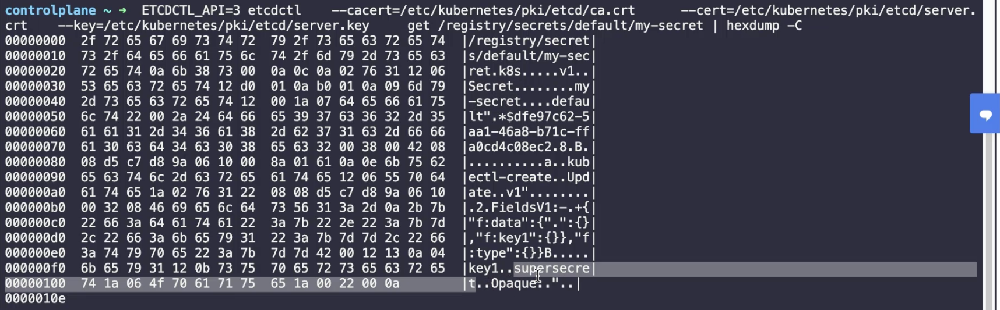
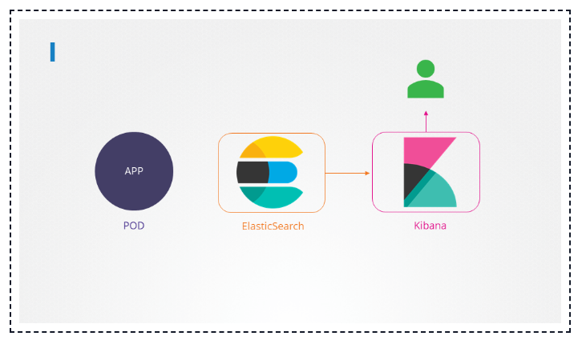

# [Application Lifecycle Management (Section 5)](Kubernetes-CKA-0400-ApplicationLifecycle-Management.pdf)

## 90. application lifecycle management - section introduction

## 91. download slide deck

## 92. rolling updates and rollbacks

- when you create a deploy, it first triggers a rollout ... rollout creates deployment revision
- next time something changes, we get another deployment revision
- for rollout status:     `k rollout status  deployment/myapp-deployment`
- for deployment history: `k rollout history deployment/myapp-deployment`
- 2 types of deploy strat:
  - `Recreate`: tear everything down and bring up new app versions / instances <-- but this leads to app downtime
  - `RollingUpdate` <-- default if you don't specify
- make changes to yaml --> kubectl apply changes --> rollout --> new revision
  - ex: we want to change the container image in a deployment: 
    - could edit yaml by hand, could:
    - `k set image deployment/myapp-deployment nginx-container=nginx:1.9.1` <-- problem here is now the yaml defn is out
    - ex: `kubectl set image deployment/frontend *=kodekloud/webapp-color:v2` <-- change for all ctrs
    - ex: `kubectl set image deployment/frontend simple-webapp=kodekloud/webapp-color:v2` 
    of sync with the actual state.
- diff b/n recreate and rollingupdate
  - `k describe` the deployment when `recreate`      you'll see in events the RS was first scaled down to 0, then up to N
  - `k describe` the deployment when `rollingupdate` you'll see in events the RS was scaled down 1 at a time, and simultaneously back up 1 at a time to match.
  - you can see in the deployment describe the `StrategyType` in the output
- undo changes: `k rollout undo deployment/myapp-deployment`


## 93. practice test - rolling updates and rollbacks

## 94. solution: rolling update

-  How many pods can be down for upgrade at any given time during a rolling update?
  - check the strategy:
    - `k describe deploy frontend` gives:
```
...
StrategyType:          RollingUpdate
...
RollingUpdateStrategy: 25% max unavailable, 25% max surge
```

since we have 4 replicas ☝️, this means only 1 can be down at any given time.

## 95. configure applications

- what can we configure?
  - commands and arguments on applications
  - env vars
  - secrets

## 96. commands (not covered on the test)

- `docker run ubuntu` runs an instance of ubuntu and exists immediately
- therefore, `docker ps` shows nothing
- however, `docker ps -a` will show the ubuntu container ran, but is in an exited state
- ctrs (unlike vms) are not meant to host an OS - they are meant to carry out a particular process
  - ex: host an instance of a webserver, app, or db
  - once the task is complete, the ctr exists. it only lasts as long as the process inside it is alive
- inside the dockerfile you'll see `CMD["something"]` like `CMD["nginx"]` ... that specifies what is running when the
ctr starts ... for mysql it is `CMD["mysqld"]` for example.
- by default, if we try to run a container with a plain ubuntu OS, the default command is `CMD["bash"]`, which is ofc not a process like a webserver or database, but rather a shell that listens for inputs from a terminal. if it can't find the terminal, it exists. when we ran the ubuntu ctr earlier, docker created a ctr from the ubuntu image and launched bash. but by default, docker does not attach a terminal to a ctr while it is run. so bash program does not find a terminal and it exits. as bash was the process that started when the ctr started, and bash is exiting, then the ctr says job done, and the ctr exists as well.
- we can override the defualt cmd specified in the image at the cli on create:
  - `docker run ubuntu [COMMAND]`
  - `docker run ubuntu sleep 5`
- but that is all a one-off. if we want a permanent different default behavior, we need to write our own dockerfile
```
FROM ubuntu
CMD sleep 5
```
- now build your new image: `docker build -t ubuntu-sleeper .`
- now run an instance as a ctr: `docker run ubuntu-sleeper`
- now what if we want to pass in a diff number for how long it should sleep? (or a diff arg for some cmd)
  - use `ENTRYPOINT` in the dockerfile:
    - 
```
FROM ubuntu
ENTRYPOINT ["sleep"] <-- that should allow us to instead do `docker run ubuntu-sleeper 10`
```
- so for `CMD`, cli _replaces_ what's in dockerfile, but for `ENTRYPOINT`, cli _appends_ to what is in dockerfile
- and if you want a default value, use both:
```
FROM ubuntu
ENTRYPOINT ["sleep"]
CMD ["5"] <-- this will be appended to the sleep command and is not a default
```
- you can also modify the ENTRYPOINT during runtime by passing in args:
  - `docker run --entrypoint <something-else> ubuntu-sleeper 10`

## 97. commands and arguments

- now, we have a docker image ... how can we use it in a pod definition file, and furthermore, how can we 
  specify args in the pod definition file?
```
apiVersion: v1
kind: Pod
metadata:
  name: ubuntu-sleeper-pod
spec:
  containers:
    - name: ubuntu-sleeper
      image: ubuntu-sleeper
      args: ["10"]  # <-- like that
```
- and, if we wanted to override the ENTRYPOINT, as in the earlier example, in the pod definition file:
```
apiVersion: v1
kind: Pod
metadata:
  name: ubuntu-sleeper-pod
spec:
  containers:
    - name: ubuntu-sleeper
      image: ubuntu-sleeper
      command: ["something-else"] # <-- equiv to: `docker run --entrypoint <something-else> ubuntu-sleeper 10` 
      args: ["10"]                # <-- equiv to: `docker run ubuntu-sleeper 10`
```
- so:
  - @ Dockerfile "ENTRYPOINT" === "command" @ pod def 
  - @ Dockerfile "CMD"        === "args"    @ pod def 

## 98. practice test - commands and arguments

# 99. solution - commands and arguments

- remember that "command" in a pod defn file is an ARRAY ... you can speficy it either way below:
```
apiVersion: v1
kind: Pod
metadata:
  name: ubuntu-sleeper-2
spec:
  containers:
  - name: ubuntu
    image: ubuntu
    command:
    - "sleep"
    - "5000"
    # OR: command: ["sleep", "5000"]
    # OR: command: ["sleep"]
    #     args: ["5000"]
```

- if you have the following in a Dockerfile:
```
...
ENTRYPOINT ["python", "app.py"]
CMD ["--color", "red"]
...
```
and you have a pod defn file using that image with the following: [.spec.containers[N].command]: `command: ["--color", "green"]`
  - the command run when the ctr starts will _NOT_ be `python app.py --color red`, it will be `--color green`
    because what is in [.spec.containers[N].command] overrides what is in Dockerfile.ENTRYPOINT.
- `k run <pod-name> --image=<image-name> -- <arg1> <arg2>`
- `k run <pod-name> --image=<image-name> --command -- <cmd> <arg>`
  - ☝️ the `--` after the `--image=<image-name>` separates what are kubectl options from cmds/options to be run inside the ctr:
    - and `--command -- <cmd>` will override the command the ctr will run with some other command
- `k run webapp-green --image=kodekloud/webapp-color -- --color green`

## 100. configure environment variables in applications

- [.spec.containers[N].env.{name|value}]
- ex:
  - 
```
$ docker run -e APP_COLOR=pink simple-webapp-color
...
...
spec:
  containers:
  - name:
  ...
  env:
    - name: APP_COLOR
      value: pink           # _directly_ specify the env var value
    - name: APP_COLOR_2
      valueFrom: 
        configMapKeyRef:    # specify env var value from _configMap_
    - name: APP_COLOR_3
      valueFrom: 
        secretKeyRef:       # specify env var value from _secret_
...
```

## 101. configuring configmaps in applications

- once you have a lot of pod defn files, it can be a pain to maintain the direct vals everywhere,
  so we can take it out into _central_ config files (ConfigMap).
- imperatively: two ways:
  - `k create configmap app-config --from-literal=APP_COLOR=blue --from-literal=<key>=<value> ...`
  - create a file with k,v pairs in it, one per line, then create ConfigMap from that file: `k create configmap app-config --from-file=app_config.properties`
- declaratively:
```
apiVersion: v1
kind: ConfigMap
metadata:
  name: app-config
data:               # 'data' instead of 'spec'
  APP_COLOR: blue
  APP_MODE: prod
```
  - one pattern is to create a diff ConfigMap for diff parts of the app: app-config, mysql-config, redis-config, etc.
  - then, inject it into the pod defn with [.spec.containers[N].envFrom[N]], like so:
```
...
spec:
  containers:
  ...
    envFrom:
      - configMapRef:
        name: app-config
...
```

## 102. practice test: environment variables

## 103. solution - environment variables

## 104. configure secrets in applications

- `k create secret generic app-secret --from-literal=DB_Host=mysql --from-literal=DB_User=root --from-literal=DB_Pass=passwd` 
- `k create secret generic app-secret --from-file=app_secret.properties`
- yaml defn looks exactly like a ConfigMap, with 'data' instead of 'spec' ... diff is we don't want secrets,
  which contain sensitive info, in plain text ... so we store it encoded instead:
  - `echo -n 'passwd' | base64` --> 'cGFzd3Jk' <-- this is the value we put into the yaml defn
    - ... but ... this is easy to decode: `echo -n 'cGFzd3Jk' | base64 --decode`, so how is this useful in hiding data?
- inject into pod defn same way as cfgmap, except [.spec.containers[N].envFrom] will be `secretRef` instead of configMapRef
- _secrets in pods as volumes_ (can do this with configmaps too)
  - in this case, each key in the volume is created as a file with key as filename, and the file contents are the values
- _notes on secrets_
  - they are _NOT_ encrypted, only _encoded_. <-- so don't check secret defn files into GitHub ...
  - nothing in etcd is encrypted by default, which means secrets stored in etcd are not encrypted ... to fix this,
    enable _encryption at REST_ to store secrets in etcd encrypted: 
      - [encrypting secret data at rest](https://kubernetes.io/docs/tasks/administer-cluster/encrypt-data/).
      - you can encrypt particular things, like only secrets, whatever.
  - anyone who can create pods/deployments in the same namespace can access the secrets ... so use RBAC to 
    cfg POLP
  - best thing is probably to use a 3rd-party secret provider like Vault. Now secrets are not stored in etcd, but in Vault.

## 105. a note about secrets!

- k8s sends secrets to nodes iff a pod on that node requires it
- kubelet stores the secret into a tmpfs so the secret is not written to disk
- once the pod using the secret is deleted, kubelet deletes its local copy of the secret too
- Read about the [protections](https://kubernetes.io/docs/concepts/configuration/secret/#protections) and [risks](https://kubernetes.io/docs/concepts/configuration/secret/#risks) of using secrets [here](https://kubernetes.io/docs/concepts/configuration/secret/#risks).

## 106. additional resource

- [Secret Store CSI Driver Tutorial | Kubernetes Secrets | AWS Secrets Manager | KodeKloud](https://www.youtube.com/watch?v=MTnQW9MxnRI) <-- 31 minute video ... <-- looks like lots of other good stuff to watch there ...

## 107. practice test - secrets

## 108. solution - secrets

## 109. demo: [encrypting secret data at rest](https://kubernetes.io/docs/tasks/administer-cluster/encrypt-data/) 

- 1. create a secret:
  - `k create secret generic my-secret --from-literal=key1=supersecret` <-- the value for key1 will be base64 encoded, but not encrypted
  - the point of this demo though is actually how it is stored in etcd. you can see what is in etcd using `etcdctl`:
    - `ETCDCTL_API=3 etcdctl --cacert=/etc/kubernetes/pki/etcd/ca.crt --cert=/etc/kubernetes/pki/etcd/server.crt --key=/etc/kubernetes/pki/etcd/server.key get /registry/secrest/default/secret1 | hexdump -C`
  - if no `etcdctl` command, try: `apt-get install etcd-client` OR just ssh into the etcd pod and run etcdctl from there

  - as you can see, the data are stored in etcd unencrypted, so anyone with access can see it.
- 2. we want to fix that, so first thing is to check if encryption at rest is already enabled or not:
  - the etcd server option is: "encryption-provider-config", so: `ps aux | grep kube-api | grep "encryption-provider-config"`
  - OR - if k8s was set up using kubeadm, `vi /etc/kubernetes/manifests/kube-apiserver.yaml` and grep / look for the option
  - if it is not there, create an `EncryptionConfiguration` and pass it in as that option
- the order in an `EncryptionConfiguration` matters: first match in providers list wins. 
- 3. follow the example [here](https://kubernetes.io/docs/tasks/administer-cluster/encrypt-data/#write-an-encryption-configuration-file).
  - ☝️ notice here _again_, you need to put a base64 encryption _key_ in the yaml defn ... which is again insecure:
    - [.resources.providers.[0].keys.[0].secret] 
- 4. add this line to the kube-apiserver config (`/etc/kubernetes/manifests/kube-apiserver.yaml`):
  - `- --encryption-provider-config=/etc/kubernetes/enc/<EncryptionConfiguration-filename>.yaml`
  - once you save the file, kube-apiserver will restart ... you can check on it with `crictl pods`
- 5. once the kube-apiserver comes back up, repeat step 1 and see if it is encrypted or not.
  - as usual, old stuff won't be back-filled, so if you want to encrypt everything that already existed before, try this:
    - `k get secrets --all-namespaces -o jason | kubectl replace -f -`
    - now all secrets have server side encryption applied

## 110. scale applications

- see deployments and rolling updates section (~ 2.32)

## 111. multi-container pods

- breaking up the monolith --> lots of small things we can mod and scale independently, without having to mess with the big app
- but ... sometimes we need two things to work together, like: [log agent + web server] ... we need them paired, but not in same code base (re-wiring the monolith!)
- in this case, we have multi-ctr pods. they share netwrk, storage, and live and die and scale together

## 112. practice test - multi-container pods

- `kubectl -n elastic-stack logs kibana`


- [k8s ckad - kibana dashboard video](https://bit.ly/2EXYdHf)

## 113. solution - multi-container pods

- elastic stack is collecting metrics - kibana will create dashboards using those
- to see pod logs, 
  - could ssh into ctr on the pod: `k -n elastic-stack exec -it app -- cat /log/app.log`, or 
  - `k logs app -n elastic-stack` 
- `k edit pod app -n elastic-stack`
  - add sidecar for logging:
    - + [.spec.containers.[N]]:
```
# this is the little orange sidecar on our app in the picture above ...
# all it does is read the logs and pass them thru to central elasticsearch
- image: kodekloud/filebeat-configured
  name: sidecar
  volumeMounts:
  - mountPath: /var/log/event-simulator
    name: log-volume
```
- now `k replace --force -f /tmp/blah.yaml`

## 114. multi-container pods design patterns

- 3 common patterns:
  - 1. sidecar (e.g., logging as per last section)
  - 2. adapter (will learn about this in CKAD course)
  - 3. ambassador (will learn about this in CKAD course)

## 115. [initcontainers](https://kubernetes.io/docs/concepts/workloads/pods/init-containers/)

- use cases:
  - need a process that completes in a container, like:
    - pull code from a repo that is needed by / will be used by the main webapp
    - wait for an external service / db to be up before webapp starts
    for these things, we can use an `initContainer`
- it goes in a pod spec in the [.spec.initcontainers] section:
```
...
spec:
  containers:
  ...
  initcontainers:
  - name: init-myservice
    image: busybox
    command: ['sh', '-c', 'git clone <some-repo> ; done;']
  ...
...
```
- when a pod is first created, the initcontainer is run to completion before the 
  "real" containers housing the app starts
- you can have N initContainers (think filter chain)

## 116. practice test - init containers

## 117. solution - init containers

- `k logs <pod-name>` will tell you the pod is down, but if we want to get the log from an individual ctr on the pod:
  - `k logs <pod-name> -c <[init-]container-name>`

## 118. self healing applications

- k8s supports self-healing apps thru:
  - `ReplicaSet`
  - `ReplicationController`
    - make sure a pod is auto recreated when pod crashes ... make sure enough replicas are always running 
  - liveness probes (will learn about this in CKAD course)
  - readiness probes (will learn about this in CKAD course)

## 119. if you like it, share it!
