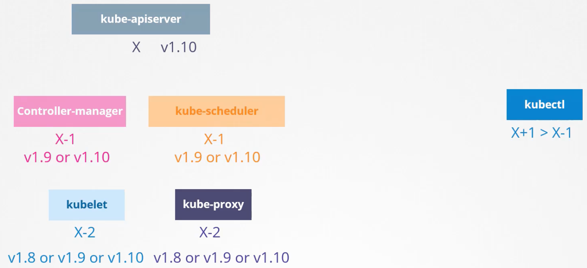

# [Cluster Maintenance (Section 6)](Kubernetes-CKA-0500-Cluster-Maintenance-v1.2.pdf)

## 120. cluster maintenance - section introduction

- topics 
  - upgrade OS, upgrade cluster
  - k8s versions and releases
  - backup, restore
  - DR

## 121. download presentation deck

## 122. os upgrades

- if pod on a node is down for > 5m, it is terminated from the node
  - `kube-controller-manager --pod-eviction-timeout=5m0s ...`
  - if part of a RS, it will be recreated on another node
  - now imagine you have a blue pod and a green pod on one node
    - imagine the blue pod is part of a RS, but the green pod is not
      - what happens when the green pod dies?
        - after 5m, the blue pod gets put on another node, but the green pod does not
- `k drain <node-name>` removes all pods to other nodes (graceful termination + recreation)
  - the node is also `cordon`ed = marked unschedulable, so  
    - now you can do some maint on the drained node
      - node comes back up after maint, `k uncordon <none-name>` to allow pods back on it
- `k cordon <node-name>` simply marks node unschedulable, does not drain it

## 123. practice test - os upgrades

## 124. solution - os upgrades

- `drain` cannot delete pods that are not managed by: ReplicationController, RS, Job, DS, or StatefulSet

## 125. kubernetes software versions

- v1.11.3
  - "v1" = major version
  - "11" = minor version - released every few months, new functionality
  - "3"  = patch version - released often, usually bug fixes
- alpha --> beta --> stable release

## 126. references

- links (not needed for CKA exam):
  - [https://kubernetes.io/docs/concepts/overview/kubernetes-api/](The Kubernetes API)
  - [https://github.com/kubernetes/community/blob/master/contributors/devel/sig-architecture/api-conventions.md](API Conventions)
  - [https://github.com/kubernetes/community/blob/master/contributors/devel/sig-architecture/api_changes.md](Changing the API)

## 127. cluster upgrade process

- let's focus on the core components:
  - `kube-apiserver` - nothing should have higher version than this
  - `kube-controller-manager` - can be -1 version to `kube-apiserver`
  - `kube-scheduler` - can be -1 version to `kube-apiserver`
  - `kubelet` - can be -2 versions to `kube-apiserver`
  - `kube-proxy` - can be -2 versions to `kube-apiserver`
  - `kubectl` - this is the only thing which _can_ be higher V than `kube-apiserver`

☝️ do not need to all be same versions. the version skew allows us to carry out live upgrades

- so when should you upgrade?
  - ex: you are on K8s v1.10
    - k8s always supports only the most recent 3 minor versions ... so ... once v1.13 comes out, you are no longer using a supported version.
    - best practice is to upgrade stepwise, one minor v at a time, and do it before 1.13 comes out so you are in support during the upgrade:
      - v1.10 --> v1.11 --> v1.12 now when v1.13 comes out, you are always under support
  - if you are on a managed service, like gcp, probably just some clicks to upgrade k8s
  - if you built it yourself with kubeadm, then 
    - `kubeadm upgrade plan`
    - `kubeadm upgrade apply`
  - if you built it "the hard way" and everything is a service, you have to manually upgrade it all
- upgrading cluster is done in 2 major steps:
  - 1. upgrade the master node(s)
    - workloads continue to serve requests, but no management functions run while compenents are down:
      - can't add stuff, can't delete stuff, can't use kubectl, etc.
      - controller mgr !work, so if a pod fails, it won't be recreated
  - 2. upgrade the worker node(s)
    - strats to upgrade worker nodes:
      - [a] upgrade all at once (breaks your app)
      - [b] rolling:
        - upgrade node01, transfers all pods to other nodes,
        - upgrade node02, transfers all pods to other nodes,
        - etc.
      - [c] add new nodes to the cluster which have the updates already
        - move workloads to new nodes and then remove old nodes
- `kubeadm plan` will tell you versions of everything and what you need to do, and give you commands to run
  - ex: upgrade recipe from v1.11 to v1.12
    - `apt-get upgrade -y kubeadm=1.12.0-00`
    - `kubeadm upgrade apply v1.12.0`
    - now `k get nodes` will still show old versions because kubelet hasn't been upgraded yet ... and it's not showing the version of the api server itself
    - now upgrade kubelets: 
      - on the master node: 
        - `apt-get upgrade -y kubeadm=1.12.0-00`
        - `kubeadm upgrade apply v1.12.0`
        - `apt-get upgrade -y kubelet=1.12.0-00`
        - restart kubelet service: `systemctl restart kubelet`
        - now `k get nodes` shows the node is upgraded
      - on the worker nodes:
        - `k drain <node-name>` to move the pods to other nodes so you can work on this one
        - `apt-get upgrade -y kubeadm=1.12.0-00`
        - `apt-get upgrade -y kubelet=1.12.0-00`
        - `k upgrade node config --kubelet-version v1.12.0`
        - restart kubelet service: `systemctl restart kubelet`
        - now mark it as schedulable again: `k uncordon <node-name>`
        - now we drain the next node, and the pods from there will find there way to our updated node, node01, etc.
  - so it's the same for master and workers, except with workers you need to be sure to move workloads first ... 
  - the goal is ofc to upgrade the cluster without taking down your apps.

## 128. demo - cluster upgrade

- follows [this](https://kubernetes.io/docs/tasks/administer-cluster/kubeadm/kubeadm-upgrade/) from the official docu
- read the notes too ... for example, about anything breaking which may have changed in between versions
- `cat /etc/*release*` <-- what distro am i using?
  - useful for example for things like [when the pkg repo changed](https://kubernetes.io/docs/tasks/administer-cluster/kubeadm/kubeadm-upgrade/#changing-the-package-repository), in which case there are diffs between OSs in how you'd accommodate that change.
- `sudo apt-cache madison kubeadm` <-- will list the available versions ... probably just pick the highest one to go to
- we update kubeadm first because we will use kubeadm to update the cluster itself ...
- when you do `k get node`, the VERSION shown is the _kubelet_ version
- big thing is just to follow the directions on the website ... walks you through the proper procedure.

## 129. practice test - cluster upgrade

## 130. solution - cluster upgrade

## 131. backup and restore methods

- _what_ should we back up? (are these options exclusive? i.e., we either backup resource cfgs, OR we backup etcd?)
  - well, what have we created?
    - resource cfgs (pod, svc, etc. defn files)
      - but we may have created these imperatively or declaratively
        - if we did it imperatively, now we have to export those to yamls, OR do this to get everything,
          whether it was created imperatively or declaratively:
            - `k get all --all-namespaces -o yaml > all-deploy-services.yaml`
        - so best practice is ofc to do everything declaratively, and store in GitHub
          - if you have this, and you lose your cluster, you can at least redeploy your entire app, just from these files
    - etcd has all cluster-related info, like state
      - so we need to back up etcd server itself ... which we can do by cfg-ing a backup tool to backup 
        the etcd configuration files dir (ex: `--data-dir=/var/lib/etcd`)
      - etcd also has a built in snapshot: `ETCDCTL_API=3 etcdctl snapshot save snapshot.db`
      - `ETCDCTL_API=3 etcdctl snapshot status snapshot.db`
      - now, to restore an etcd from this snapshot:
        - stop kube-apiserver, because cycling it will require etcd to cycle: `service kube-apiserver stop`
        - restore: `ETCDCTL_API=3 etcdctl snapshot restore snapshot.db --data-dir=/var/lib/etcd-from-backup`
          - etcd will start everything over so nobody can accidentally join the existing cluster
          - now, re-cfg the etcd configuration files dir (ex: `--data-dir=/var/lib/etcd-from-backup`)
          - now, restart things:
            - `systemctl daemon-reload`
            - `service etcd restart`
            - `service kube-apiserver start`
      - ☝️ for all those etcd commands, if TLS is enabled, it's mandatory to also include the following flags:
        - `--endpoints=https://127.0.0.1:2379`
        - `--cacert=/etc/etcd/ca.crt`
        - `--cert=/etc/etcd/etcd-server.crt`
        - `--key=/etc/etcd/etcd-server.key`
    - do we have persistent volumes?
- you can alternatively use things like velero to do backups thru the k8s api
- if you are using a CSP to manage this, you likely won't anyway have access to etcd, so you'll have to back up via
  resource cfgs (yaml files).

## 132. working with etcdctl

## 133. practice test - backup and restore methods

