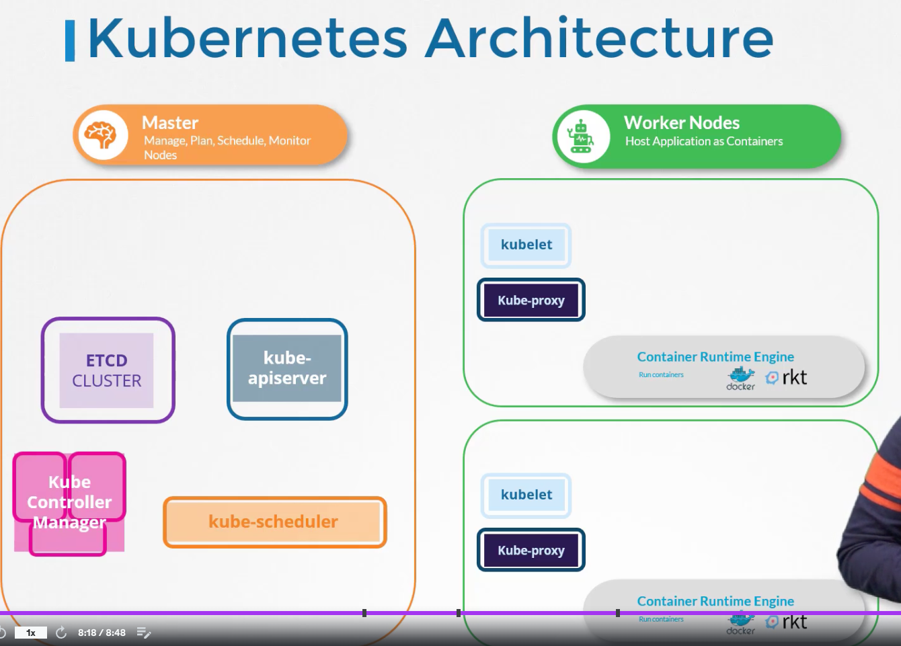
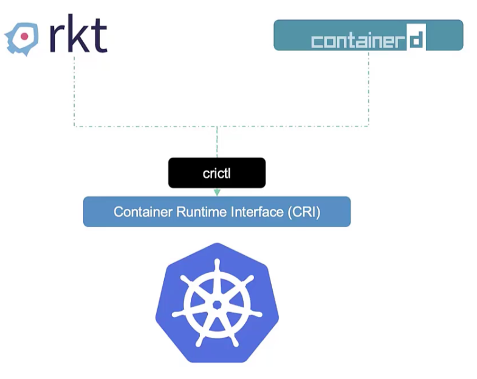
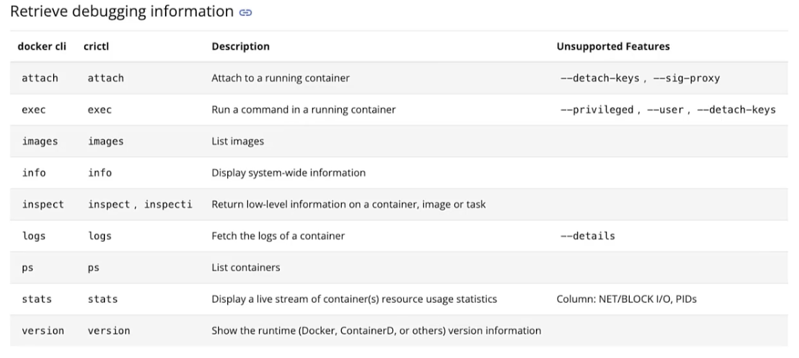

## 11. k8s arch

- worker nodes are the ships that actually transport the cargo
- master node is the ship that loads the cargo ships / worker nodes
- master ship keeps track of what goes on what ship using control plane
  - control plane is comprised of
    - [etcd]: (k,v) store that knows what is on what ship
    - [kube-scheduler]: cranes on the master ship load worker ships based on
                        their size, capacity, what other containers are already
                        on the ship, etc.
    - [controller-manager]
      - [node-controller]
      - [replication-controller]
    - and this ^^ is all orchestrated by the [kube-apiserver]
- ALL nodes need container runtime (docker, containerd, rkt)
- ALL nodes need [kubelet]. kubelet is like the captain of the ship ... the 
  captain listens to instructions from kube-apiserver ... kube-apiserver polls
  kubelets to make sure status == spec
- [kube-proxy] on workers to make sure they can comm w/ each other ... think
  db talking to app on diff nodes

## 12. docker v containerd

- [CRI] so that ppl can use more than just Docker
- must adhere to [OCI]
  - [imagespec]: how to build an image
  - [runtimespec]: how ctr runtime should be built
- now rkt supported as container runtime via cri
- but docker did not support CRI, so k8s added "dockershim" to keep docker 
  working. 
- [runc] was docker ctr runtime ... [containerd] is the daemon that manages runc.
- containerd is CRI-compat, so it can work directly with k8s - and it can be 
  used as a runtime on its own, separate from docker.
- because containerd can run on it's own, and because it was a lot of effort
  to maintain dockershim, support for docker was removed from k8s in 1.24
- docker followed imagespec so anything that was already written is still
  supported thru containerd
- so containerd, which was a part of docker, is now it's own cncf proj. you 
  don't need docker anymore
- containerd comes with CLI [ctr] which is for debugging
  - $ ctr images pull docker.io/library/redis:alpine
  - $ ctr run         docker.io/library/redis:alpine redis
- but it's limited, use instead [nerdctl], which is a docker-like CLI for 
  containerd.
    - can more or less replace "docker" with "nerdctl" for all docker cmds
      - $ [docker | nerdctl] run --name redis     redis:alpine
      - $ [docker | nerdctl] run --name webserver -p 80:80 -d nginx
- [crictl] is designed to interact with things impl / compat w/ CRI
  - it works across different ctr runtimes, whereas nerdctl is developed by
    containerd, crictl is developed by k8s
  - it is mostly a debugging tool (like ctr), works along with kubelet
  - $ crictl pull busybox
  - $ crictl images
  - $ crictl ps -a
  - $ crictl exec -i -t <ctr-id> ls <-- run ls command inside ctr
  - $ crictl logs <ctr-id>
  - $ crictl pods <-- list pods ... docker can't do this

## 13. etcd for beginners

- in a typical rdbms, every time you add a column, you need to update everything
  - ex: [person, age, location] ... you end up with a lot of empty cells, or
        needing to backfill:

        person  | age   | location 
        john    | 45    | nyc
        dave    | 34    | nyc
        aryan   | 10    | nyc
        lauren  | 13    | bangalore
        lily    | 15    | bangalore

        let's add income info ... well, the young people won't have that, as
        they are students:

        person  | age   | location  | income 
        john    | 45    | nyc       | 5000
        dave    | 34    | nyc       | 4000
        aryan   | 10    | nyc       | --- 
        lauren  | 13    | bangalore | ---
        lily    | 15    | bangalore | ---

        let's add grades ... well, the old people won't have that, as they
        are workers:

        person  | age   | location  | income    | grades
        john    | 45    | nyc       | 5000      | ---
        dave    | 34    | nyc       | 4000      | ---
        aryan   | 10    | nyc       | ---       | A
        lauren  | 13    | bangalore | ---       | C
        lily    | 15    | bangalore | ---       | B

- [etcd] on the other hand, stores data in (k,v) pairs in "pages":

        {
            name: john,
            age: 45,
            location: nyc,
            income: 5000
        }
        {
            name: dave,
            age: 34,
            location: nyc,
            income: 4000
        }
        {
            name: aryan,
            age: 10,
            location: nyc,
            grades: A
        }
        {
            name: lauren,
            age: 13,
            location: bangalore,
            grades: C
        }
        {
            name: lily,
            age: 15,
            location: bangalore,
            grades: B
        }
- changes to one page don't affect others ... don't need to update all docs
  at once.
- [etcdctl] is CLI for etcd
  - $ etcdctl --version (etcdtl version != api version)
  - $ etcdctl   version (notice in v3, "version" is a subcommand, not an option
  - $ etcdctl set key1 val1 <-- etcd v2
  - $ etcdctl put key1 val1 <-- etcd v3
  - $ etcdctl get key1      <-- etcd v2
- etcd is cncf ... had big changes between v2 and v3 (2017) ... etcdctl will 
  work with both versions
    - to ensure working with v3:
      - $ export ETCDCTL_API=3
- when you don't set the api version, it is assumed to be v2 (why? - v3 came
  out 6 years ago!)

## 14. etcd in k8s

- stores info about: nodes, pods, configs, secrets, accounts, roles, bindings, 
  etc.
- every time you run `kubectl get` you are getting that info from etcd server
- changes are not considered complete until they happen in the etcd server
- etcd start option `--advertise-client-urls` is where etcd is listening
- by default, port 2379
- if you set up k8s cluster using [kubeadm], kubeadm will set etcd up as a Pod
  in the kube-system ns ... in this case, want to get all keys?
    - $ kubectl exec etcd-master -n kube-system etcdctl get / --prefix -keys-only

## 15. etcd - commands
 
| v2 | v3 |
| - | - |
| etcdctl backup | etcdctl snapshot save |
| etcdctl cluster-health | etcdctl endpoint health |
| etcdctl mk | etcdctl get |
| etcdctl set | etcdctl put |

`kubectl exec etcd-master -n kube-system -- sh -c "ETCDCTL_API=3 etcdctl get / --prefix --keys-only --limit=10 --cacert /etc/kubernetes/pki/etcd/ca.crt --cert /etc/kubernetes/pki/etcd/server.crt --key /etc/kubernetes/pki/etcd/server.key"`

## 16. kube-apiserver

- kubectl: (can do everything by api direct (curl, etc.) , without using kubectl)
  - calls kube-apiserver
    - kube-apiserver:
      - intercepts request, 
      - validates it (auth / auth / admit)
      - gets data from etcd 
      - responds back
- scheduler monitors kube-apiserver, 
    - tells kube-apiserver where to put pods, 
    - then kube-apiserver updates etcd, 
    - then kube-apiserver passes the new info to kubelet on a node,
    - then kubelet creates a pod on the node and tells the ctr runtime engine to deploy the app image,
    - when done, kubelet lets kube-apiserver know, 
    - and kube-apiserver lets etcd know
- the basic path is always:
  - 1. authenticate user (kube-apiserver)
  - 2. validate request  (kube-apiserver)
  - 3. retrieve the data (kube-apiserver)
  - 4. updtate etcd      (kube-apiserver)
  - 5. scheduler         
  - 6. kubelet            
  - 7. then back up the chain to etcd
- just like with etcd, you can install kube-apiserver as a standalone service
  on the control plane node. see options at:
  `/etc/systemd/system/kube-apiserver.service`
- just like with etcd, if you used kubeadm to set up the cluster, kube-apiserver
  is deployed as a pod in kube-system ns. see options at:
  `/etc/kubernetes/manifests/kube-apiserver.yaml`
- you can also just look at the process on the master node:
  `ps aux | grep kube-apiserver`

## 17. kube controller manager

- node-controller default check ("node monitor period") is 5s ... 
  "grace period" (time until it marks node as "unreachable") is 40s ... 
  after node is marked "unreachable", we give it 5m to come back up ("pod eviction timeout")
- if we reach pod eveiction timeout, node controller moves those pods from that
  node to other nodes, as long as they were part of ReplicaSet
- there are controllers for everything ... think about it ... what is a "Kind"
  and how do we ensure each "Kind" is behaving as in spec? by watching it. Each
  CRD can have a controller associated with it.
- all controllers in your cluster are pkgd into a single proc called 
  "kube-controller-manager" ... ^^ those things like node monitor period, 
  grace period, etc., go into the kube-controller-manager service as options:
  - `--node-monitor-period=5s`
  - `--node-monitor-grace-period=40s`
  - `--pod-eviction-timeout=5m0s`
- and we enable which controllers to use here too:
  - `--controllers stringSlice  Default[*]` <-- all controllers enabled default
    - ^^ if some controller(s) don't seem to work/exist, this is a good first
      troubleshooting step ... check this list.
- same as kube-apiserver, same as etcd, if you installed cluster via kubadm,
  kube-controller-manager lives as a pod on the master node. cfg is here:
  `/etc/kubernetes/manifests/kube-controller-manager.yaml`
- if you hand rolled your cluster ("the hard way"):
  `/etc/systemd/system/kube-controller-manager.service`
- `ps aux | grep kube-controller-manager`

## 18. kube scheduler

- remember: kube-scheduler only _decides_ what node a pod should go on, it does
  _not_ actually place it there. that's up to the kubelet on the proper node
  ("kubelet on a node" == "captain on a ship")
- imagine diff sized ships going to diff places ... this is like diff nodes
  with diff resources, serving diff apps. the scheduler has to know all these
  constraints to make sure to tell the captain of the right ship that this 
  pod (with containers) is to go on his ship. you don't want to put the wrong 
  pods (with containers) on the wrong ships.
- scheduler does this in 2 phases:
  1. filter - ex: only consider nodes that meet memory and cpu requirements
  2. rank   - uses a prio function to give each remaining node a score 0-10
            - one way is to calculate how much space would be left on the node
              after we put this pod on it 
- we can customize everything and even add our own scheduler
- scheduler also looks at: taints, tolerations, node selectors, affinity 
 
- same as kube-controller-manager, same as kube-apiserver, same as etcd, 
  if you installed cluster via kubadm, kube-scheduler lives as a pod on the 
  master node. cfg is here:
  `/etc/kubernetes/manifests/kube-scheduler.yaml`
- if you hand rolled your cluster ("the hard way"):
  `/etc/systemd/system/kube-scheduler.service`
- `ps aux | grep kube-scheduler`

## 19. kubelet

- captain of individual worker ships
- single point of contact from worker ships to master ship (ctrl pln)
- "responsible for all paperwork"
- load or unload containers (pods) from their ships as instructed by scheduler
- send back regular reports on status of ship
- kube-scheduler tells kube-apiserver pod goes to node a 
  - kube-apiserver tells kubelet on node a to create the pod
    - kubelet on node a tells container runtime on node a to pull image and create instance
      - kubelet monitors and reports back to kube-apiserver
- important note: kubeadm does _not_ auto deploy kubelet ... diff to the other 
  components so far. must _always_ manually install kubelets on workers.
  = download the installer, extract it, use it as a service
- `ps -aux | grep kubelet`

## 20. kube-proxy

- 
